Draw Circos Plot
================

Create Circos Plot
------------------

#. Go to **Plot** menu -> **Circos Plot** -> **Create Circos Plot** or Click the "Create Circos Plot" icon on the toolbar to open circos plot creation dialog.

	.. figure:: _static/circos_create.png
		:width: 400
		:align: center

		Circos plot creation dialog

#. Select karyotype data.

#. Input a name for the created circos plot.

#. Click ``OK`` button to create circos plot.

Add Circos Track
----------------

#. Go to **Plot** menu -> **Circos Plot** -> **Add Circos Track** to add a plot track. 

#. Or click the **Add Circos Track** icon on the toolbar to add a plot track.

Update Circos Plot
------------------

Every time you modify the drawing parameters, you should redraw the circos plot to update the display.

#. Go to **Plot** menu -> **Circos Plot** -> **Update Circos Plot** to redraw circos plot.

#. Or click **Update Plot** icon on the toolbar to redraw circos plot.

Circos Ideogram Parameters
--------------------------

Ideogram Style
^^^^^^^^^^^^^^

The parameters for drawing ideograms can be found in Circos documentation: `https://circos.ca/documentation/tutorials/reference/ideogram/ <https://circos.ca/documentation/tutorials/reference/ideogram/>`_

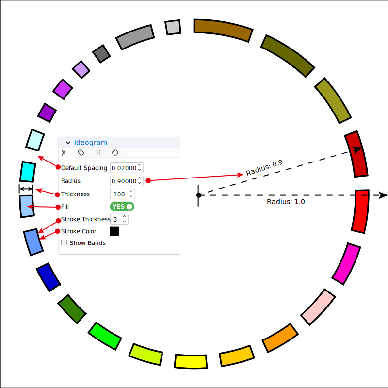

	Ideogram parameters

.. tip::

	Generally, we set radius < 1.0 to leave some blank space for putting the ideogram labels and ticks.

Ideogram Bands
^^^^^^^^^^^^^^

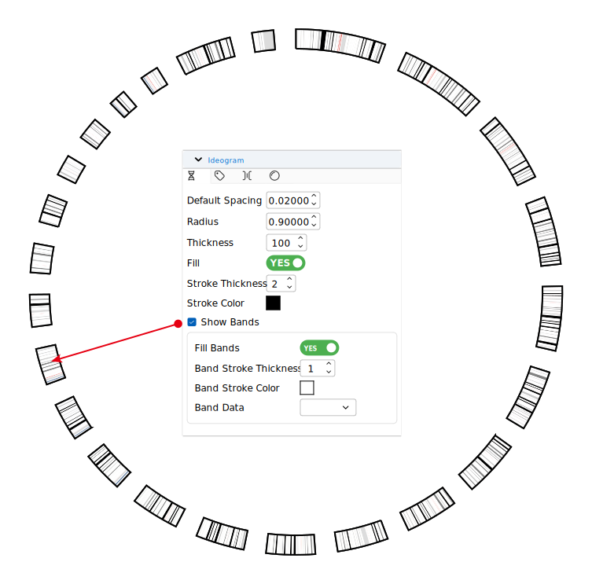

	Ideogram band parameters

You can toggle ``Show Bands`` to show or hide ideogram bands. If you have no bands information in your karyotype data. You can prepare it and then select it in ``Band Data``.

.. note::

	``Band Data`` is an optional. Sometimes, your imported karyotype may contains genome band information.

Ideogram Labels
^^^^^^^^^^^^^^^

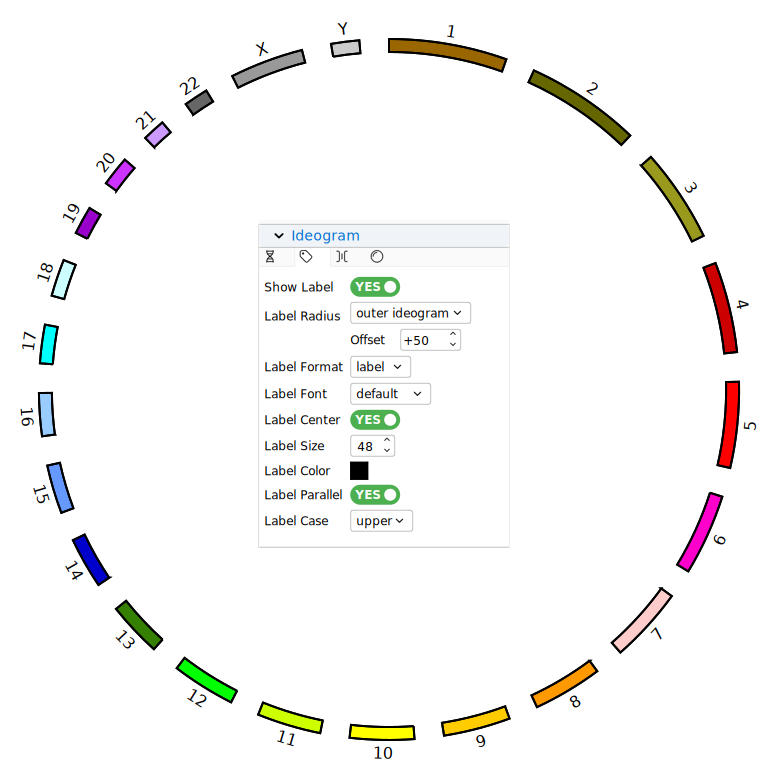

	Ideogram label parameters

You can toggle ``Show Label`` to show or hide ideogram labels.

Some parameters that require special explanation:

#. ``Label radius``: radial position of ideogram label. The label can be put to the outer, inner, or inside ideogram.

	.. tip::

		You are allowed to set an offset (pixel) to fine-tune the label position.
	

#. ``Label format``: show text of label or name column in karyotype data.
#. ``Label center``: the label to be centered at the radius.
#. ``Label parallel``: toggles the ideogram label to be parallel to the ideogram segment.

Ideogram Specific Spacing
^^^^^^^^^^^^^^^^^^^^^^^^^

You are allowed to set specific spacing between adjacent ideograms. You can use right-click menu on the ideogram specific spacing panel to add spacing. You can select two ideograms or chromosomes to add specific space between them.

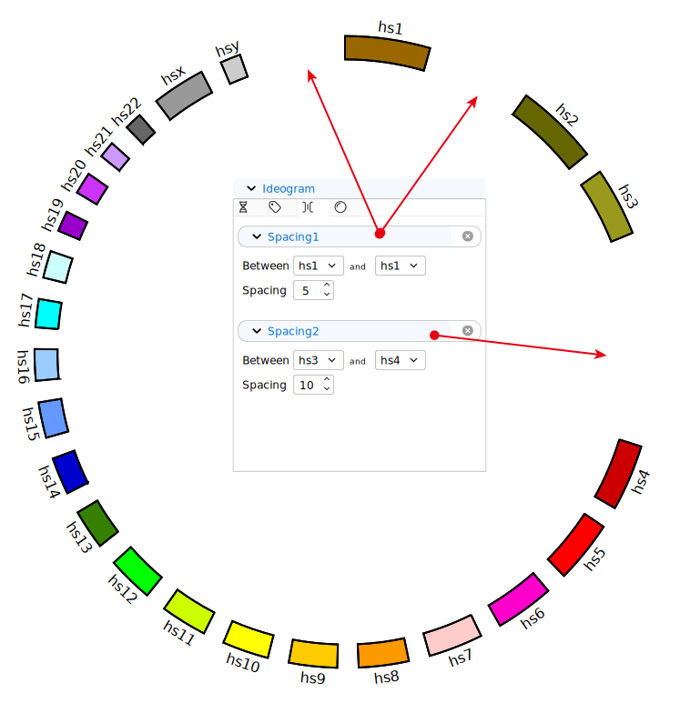

	Specific ideogram spacing parameters

#. ``Between``: select two adjacent ideograms.

	.. tip::

		If the two ideograms you select are the same, the space will be added on both sides of that ideogram.

#. ``Spacing``: its value represents a multiple of the default spacing.

Ideogram Specific Radius
^^^^^^^^^^^^^^^^^^^^^^^^

You are allowed to set specific radius for selected ideograms. You can use right-click menu on the ideogram specific radius panel to add radius. You can select a chromosome to add specific radius.

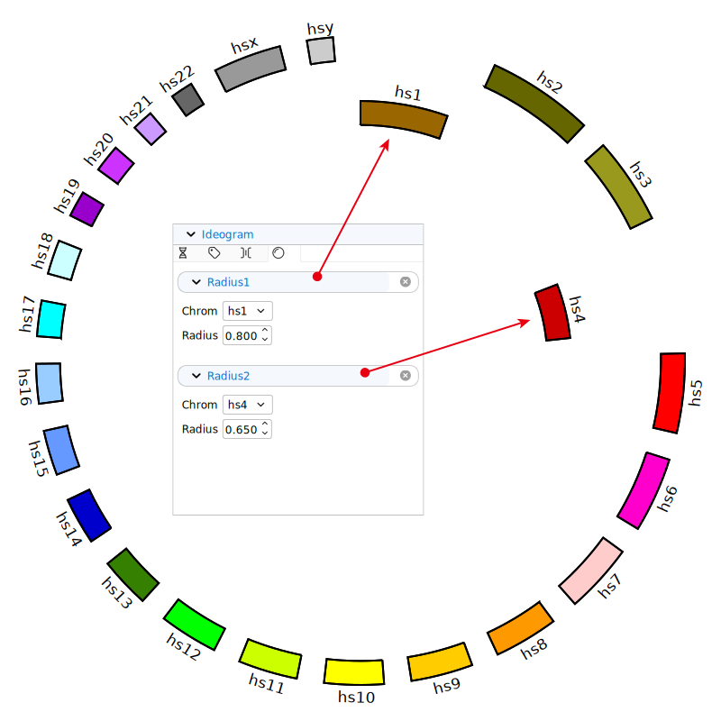

	Specific ideogram radius parameters

#. ``Chrom``: select a chromosome or ideogram.
#. ``Radius``: the specific radius value.

Circos Tick Parameters
----------------------

Tick Display
^^^^^^^^^^^^

The tick parameters for circos can be found in `Circos documentation <https://circos.ca/documentation/tutorials/ticks_and_labels/basics/>`_.

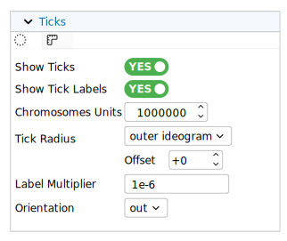

	Tick parameters

#. ``Show ticks``: toggle to show or hide ticks
#. ``Show tick labels``: toggle to show or hide tick labels
#. ``Chromosome units``: it is an important parameter for drawing tick marks. Default value of 1000000 means 1 unit(u) = 1Mb.
#. ``Tick radius``: it is the same with ``Label radius``, control the tick position.
#. ``Label multiplier``: it is a constant used to multiply the tick value to obtain the tick label. For example, the default multiplier is 1e-6 (10\ :sup:`-6`), then the tick mark at position 10,000,000 will have a label of 10.
#. ``Orientation``: controls whether the ticks and labels face out (orientation=out) or in (orientation=in)

Tick Marks
^^^^^^^^^^

Even if you turn on ``Show ticks`` and ``Show tick labels``, you may not see any tick marks unless you add them. On the tick mark panel, you can use right-click menu to add tick mark.

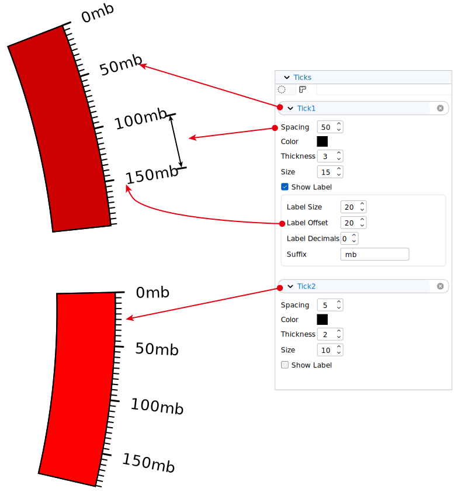

	Tick mark parameters

#. ``Spacing``: the most important parameter to control tick mark display. It is a multiplier of ``chromosome units``, for example chromosome units = 1Mb, spacing = 50 indicates that a mark is drawed every 50 Mb.
#. ``Show label``: toggle to show or hide tick mark label.
#. ``Suffix``: add suffix for tick mark label, the label is obtained by ``position * label multiplier``, when multiplier = 1e-6, the obtained label can be added with unit (mb).

Circos Plot Parameters
----------------------

Plot Track Panel
^^^^^^^^^^^^^^^^

Circhart allows you to draw scatter, line, histogram, stacked (histogram), heatmap, tile, text, connector, highlight and link plot tracks. You can adjust the plot parameters in track panel.

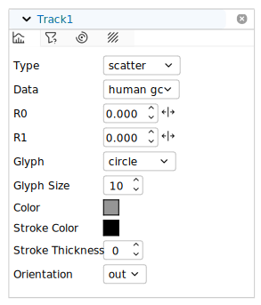

	Plot track parameter panel

**Track Tabs**

The track panel contains four tabs:

.. list-table:: The description of tabs
	:header-rows: 1
	:align: center
	
	* - Tab
	  - Description
	* - |chart|
	  - main paramter tab for drawing plot
	* - |rule|
	  - rule tab for controlling plot display using conditions
	* - |axis|
	  - axes tab for adding axis grids to plot track
	* - |background|
	  - background tab for adding background color to plot track

**Track Radius**

In main tab, you can change the plot ``Type`` and select plot ``Data``. Except for link track, the other tracks require a specified position. Circos uses two radius: radius0 (``R0``) and radius1 (``R1``) to control the position and thickness of the plot tracks.

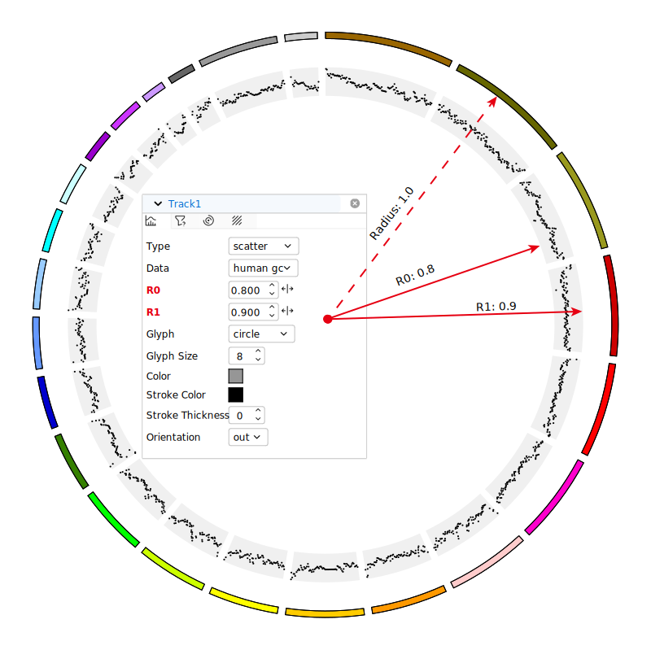

	Radius of plot track

**Track Radius Offset**

The radius supports setting an offset value to fine-tune the radius position. You can click the |offset| button to open offset input box where you can input a number (pixel).

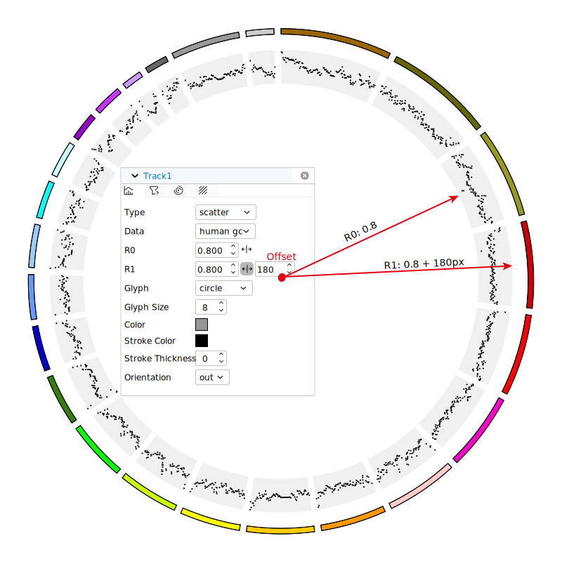

	Radius offset of plot track

**Track Rules**

In the rule panel, you can control the display of plot according to specified conditions. You can use right-click menu to add rule. In rule conditions, you can click |add| to add a new condition, you can click |delete| to delete the last condition. Similarly, in rule styles, you can click |add| to add a new style, you can click |delete| to delete the last style.

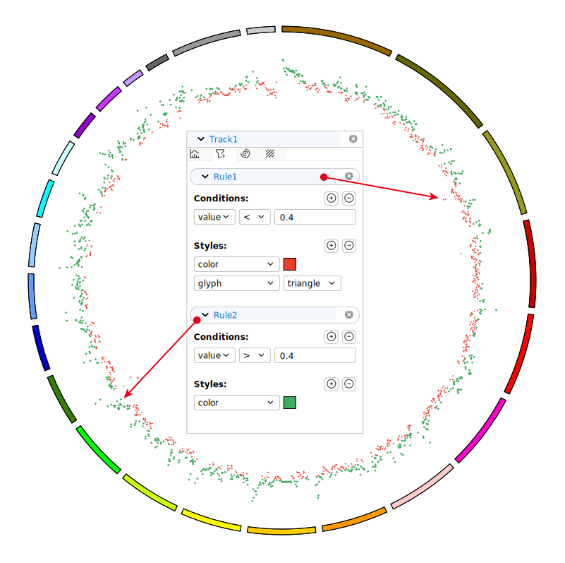

	Display rules of plot track

**Track Axes**

In the axes panel, you can add the axis grids for the plot track.

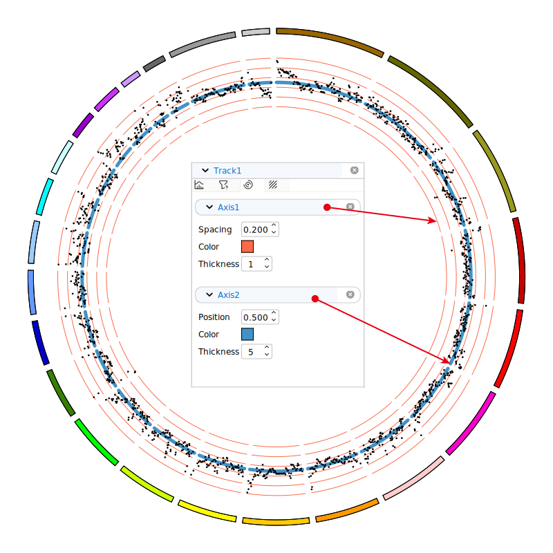

	Axis grids of plot track

There are two ways to add axis grids:

#. Right-click menu -> Add Spacing Axis -> Input a spacing value. For example, spacing=0.2 means that the axis will be drawed every 20% thickness of plot track.
#. Right-click menu -> Add Fixed Position Axis -> Input a position value. For example, position=0.5 means that the axis will be drawed at 50% thickness of plot track.

**Track Background**

In the background panel, you can add background with color for the plot track.

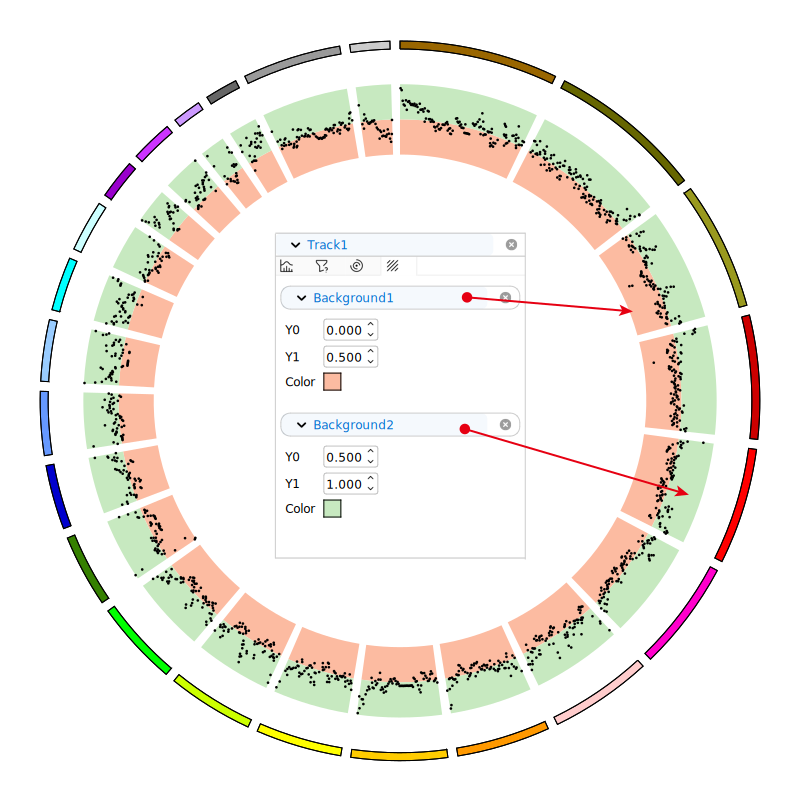

	Background of plot track

You can use ``y0`` (start position) and ``y1`` (end position) to control the background position. For example, y0=0 and y1=0.5 means that the background will be drawed from 0% thickness to 50% thickness of plot track.

Scatter Plot Track
^^^^^^^^^^^^^^^^^^

If you select plot type of **scatter**, you are only allowed to select data from type of *plotdata*. The parameter description can be found in `Circos Documentation <https://circos.ca/tutorials/lessons/2d_tracks/scatter_plots/>`_.

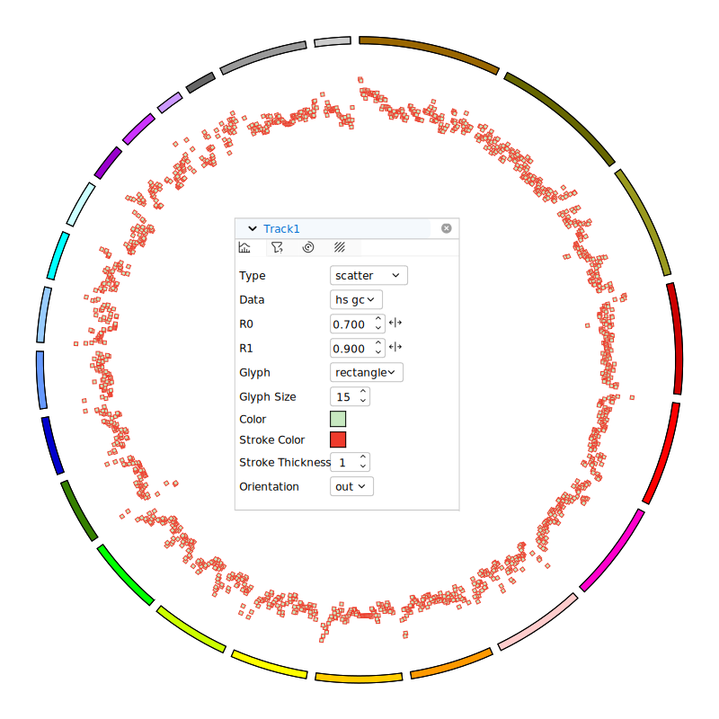

	Scatter plot parameters

Line Plot Track
^^^^^^^^^^^^^^^

If you select plot type of **line**, you are only allowed to select data from type of *plotdata*. The parameter description can be found in `Circos Documentation <https://circos.ca/documentation/tutorials/2d_tracks/line_plots/>`_.

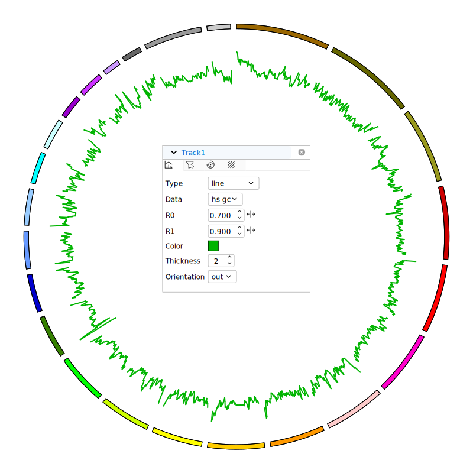

	Line plot parameters

Histogram Plot Track
^^^^^^^^^^^^^^^^^^^^

If you select plot type of **histogram**, you are only allowed to select data from type of *plotdata*. The parameter description can be found in `Circos Documentation <https://circos.ca/documentation/tutorials/2d_tracks/histograms/>`_.

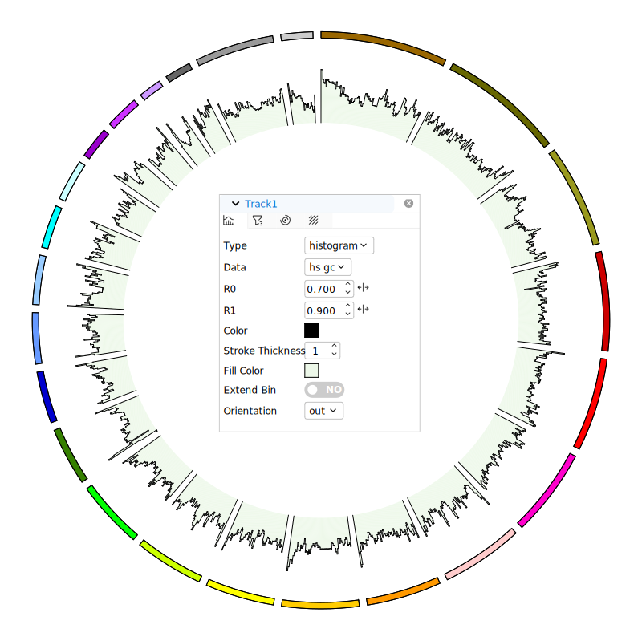

	Histogram plot parameters

Stacked Plot Track
^^^^^^^^^^^^^^^^^^

Stacked plot is essentially a histogram plot as well. Whereas, you should select data from type of *textdata*. The value column has multiple values separated by comma like this:

.. code::

	hs1 0 1999999 113.0000,20.0000,7.0000,40.0000
	hs1 2000000 3999999 34.0000,0.0000,0.0000,0.0000
	hs1 4000000 5999999 2.0000,0.0000,0.0000,0.0000
	hs1 6000000 7999999 1.0000,4.0000,0.0000,0.0000
	hs1 8000000 9999999 2.0000,5.0000,4.0000,0.0000
	hs1 10000000 11999999 0.0000,1.0000,0.0000,0.0000
	hs1 12000000 13999999 148.0000,2.0000,0.0000,0.0000
	hs1 14000000 15999999 2.0000,0.0000,0.0000,0.0000
	hs1 16000000 17999999 162.0000,1.0000,5.0000,1.0000
	hs1 18000000 19999999 2.0000,0.0000,0.0000,0.0000
	...

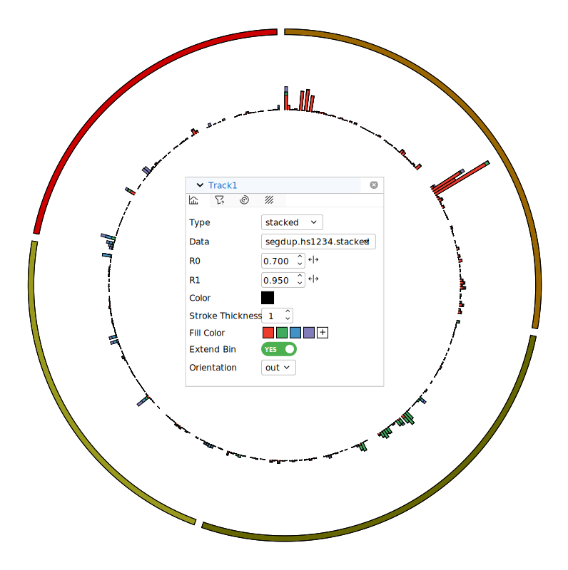

	Stacked histogram plot parameters

In stacked plot panel, you can select a fill color for each value as different category. In ``Fill color``, you can click |addc| to add multiple colors. You are also allowed to use right-click menu on fill colors to remove colors.

Heatmap Plot Track
^^^^^^^^^^^^^^^^^^

If you select plot type of **heatmap**, you are only allowed to select data from type of *plotdata*. The parameter description can be found in `Circos Documentation <https://circos.ca/documentation/tutorials/2d_tracks/heat_maps/>`_.

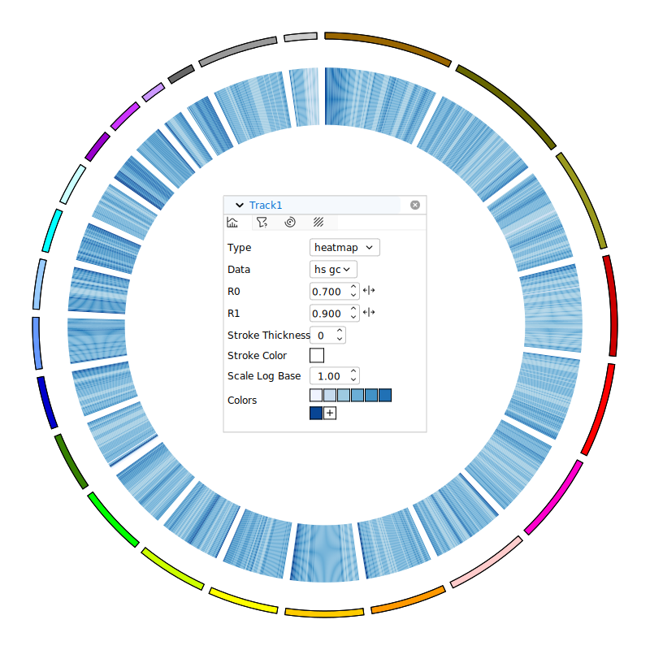

	Heatmap plot parameters

If you set ``scale_log_base``, the mapping will be logarithmic. If ``scale_log_base`` <1, the dynamic range of color mapping of small values will be increased. If ``scale_log_base`` >1, then dynamic range of large values will be increased.

You can select multiple colors by clicking |addc| for value mapping. You are also allowed to use right-click menu on colors to remove colors.

Tile Plot Track
^^^^^^^^^^^^^^^

If you select plot type of **tile**, you are only allowed to select data from type of *locidata*. The parameter description can be found in `Circos Documentation <https://circos.ca/documentation/tutorials/2d_tracks/tiles/>`_.

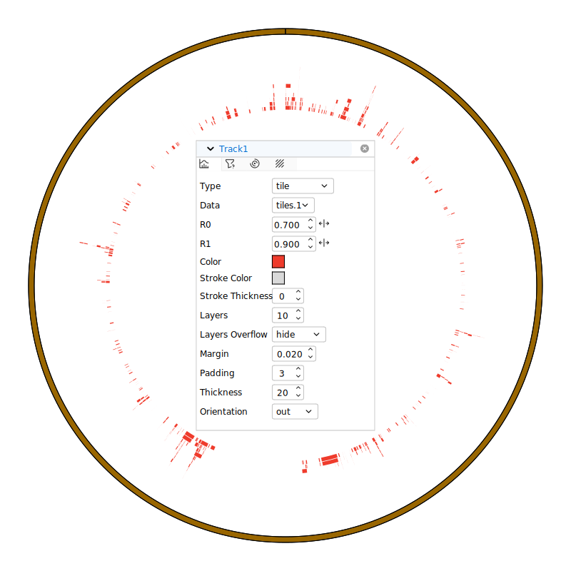

	Tile plot parameters

Text Plot Track
^^^^^^^^^^^^^^^

Connector Plot Track
^^^^^^^^^^^^^^^^^^^^

Highlight Plot Track
^^^^^^^^^^^^^^^^^^^^

Link Plot Track
^^^^^^^^^^^^^^^

