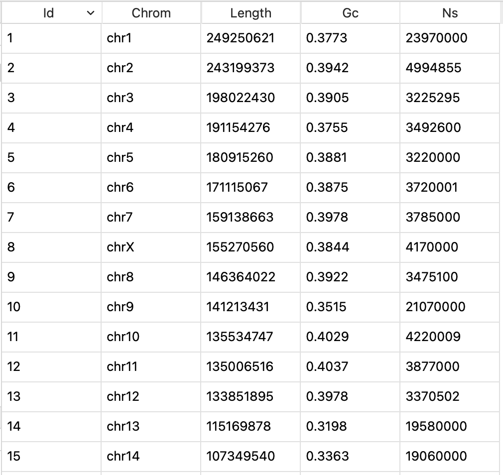
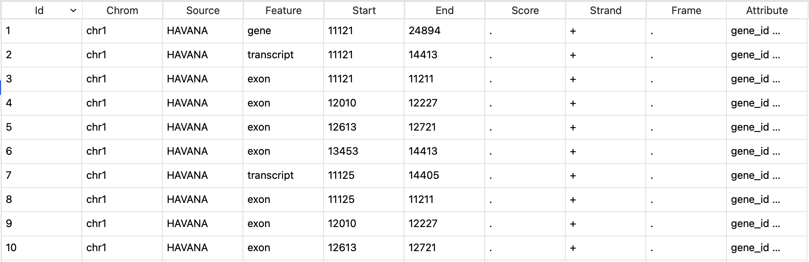
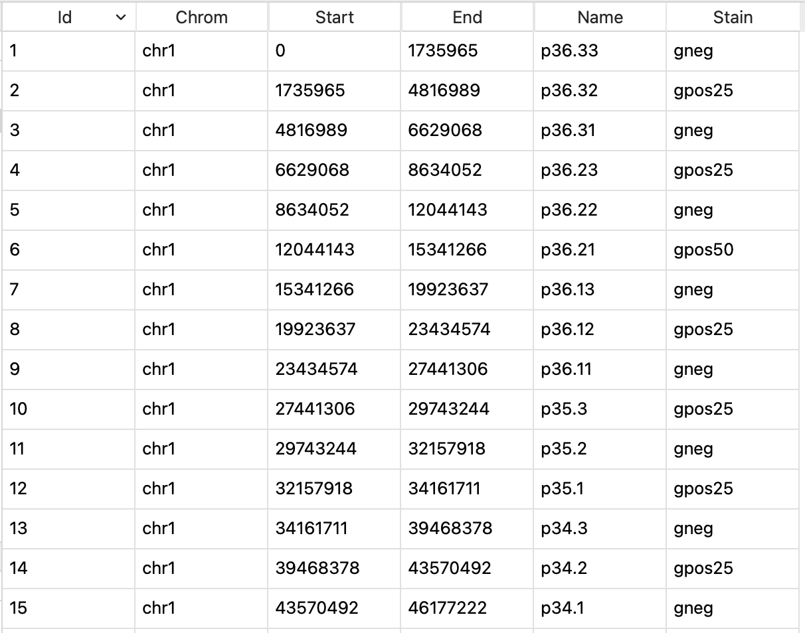
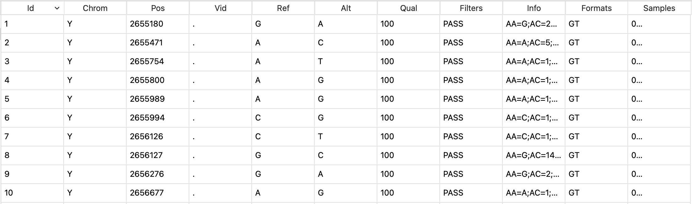
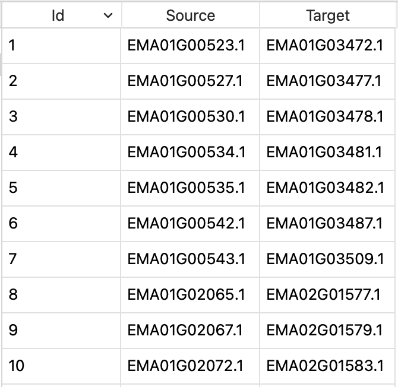

Import Data
===========

Import Genome File
------------------

The genome data can be used to generate karyotype data for circos plotting and draw snail plot.

Go to **File** menu -> **Import Data** -> **Import Genome File...** to select a FASTA formatted genome file (gzip compressed genome file supported). The imported genome data has five columns: id, chrom, length, gc, ns. 

.. list-table:: The description of columns in genome data
	:header-rows: 1
	:align: center

	* - Column
	  - Description
	* - id
	  - chromosome id generated by circhart
	* - chrom
	  - chromosome name
	* - length
	  - total number of bases
	* - gc
	  - GC contents
	* - ns
	  - number of unknown bases

	View of imported genome data

.. note::

	The imported genome data will be assigned data type of ``genome``.

Import Genome Annotation
------------------------

The annotation data can be used to prepare circos plot data.

Go to **File** menu -> **Import Data** -> **Import Genome Annotation** to select a GTF or GFF file to import. The GTF or GFF file can be gzip compressed. 

	View of imported annotation data

.. note::

	The entire annotation file will not be loaded into circhart. It will read the first 1000 lines to get feature and attribution information. The imported data will be assigned data type of ``annotation``.

Import Genome Bands
-------------------

The genome bands can be used to prepare band data for circos plotting. Not all species have genome bands. You can go to UCSC to download genome bands.

#. Go to `UCSC Genome Table Browser <https://genome.ucsc.edu/cgi-bin/hgTables>`_.

	.. figure:: _static/bands.png
		:width: 500
		:align: center

		UCSC Genome Table Browser

#. Select a genome and assembly you desired.

#. Select **Mapping and Sequencing** for Group.

#. Select **Cytobands (Ideogram)** or **Chromosome Band (Ideogram)** for Track.

#. Input output filename

#. Click ``Get output`` button to download genome bands.

#. Go to **File** menu -> **Import Data** -> **Import Genome Bands...** to select downloaded bands file.

The imported genome bands has five columns: chrom, start, end, name, stain.

.. list-table:: The description of columns in genome bands
	:header-rows: 1
	:align: center

	* - Column
	  - Description
	* - id
	  - uniq id generated by circhart
	* - chrom
	  - chromosome name
	* - start
	  - start position
	* - end
	  - end position
	* - stain
	  - stain color name

	View of genome bands

Import Genome Variations
------------------------

The genome variation data can be used to prepare circos plot data.

Go to **File** menu -> **Import Data** -> **Import Genome Variations** to select a VCF file to import variations. The VCF file can be gzip format.
	

	View of imported variation data

.. note::

	Similarly, Circhart will read the first 1000 lines. The imported data will be assigned data type of ``variations``.

Import Genome Regions
---------------------

The genome region data can be used to prepare circos plot data. The genome region data is generally stored as BED format.

Go to **File** menu -> **Import Data** -> **Import Genome Regions** to select a BED file to import regions. The BED file can be gzip format.

	.. figure:: _static/bed_data.png
		:width: 400
		:align: center

		View of imported bed data

	.. note::

		Similarly, Circhart will read the first 1000 lines. The imported data will be assigned data type of ``regions``.

Import collinearity file
------------------------

The collinearity file is the result of synteny analysis generally generated by `MCScanX <https://github.com/wyp1125/MCScanX>`_ and can be used to prepare link data for circos plotting.

The collinearity file contains contents like this:

.. code::

	############### Parameters ###############
	# MATCH_SCORE: 50
	# MATCH_SIZE: 5
	# GAP_PENALTY: -1
	# OVERLAP_WINDOW: 5
	# E_VALUE: 1e-05
	# MAX GAPS: 25
	############### Statistics ###############
	# Number of collinear genes: 647, Percentage: 2.91
	# Number of all genes: 22209
	##########################################
	## Alignment 0: score=314.0 e_value=1.6e-07 N=7 em01&em01 plus
	  0-  0:        EMA01G00523.1   EMA01G03472.1         0
	  0-  1:        EMA01G00527.1   EMA01G03477.1    1e-138
	  0-  2:        EMA01G00530.1   EMA01G03478.1     4e-88
	  0-  3:        EMA01G00534.1   EMA01G03481.1         0
	  0-  4:        EMA01G00535.1   EMA01G03482.1         0
	  0-  5:        EMA01G00542.1   EMA01G03487.1    4e-113
	  0-  6:        EMA01G00543.1   EMA01G03509.1         0
	## Alignment 1: score=316.0 e_value=1.7e-09 N=7 em01&em02 plus
	  1-  0:        EMA01G02065.1   EMA02G01577.1     3e-40
	  1-  1:        EMA01G02067.1   EMA02G01579.1     1e-21
	  1-  2:        EMA01G02072.1   EMA02G01583.1         0
	  1-  3:        EMA01G02081.1   EMA02G01586.1         0
	  1-  4:        EMA01G02101.1   EMA02G01593.1     4e-43
	  1-  5:        EMA01G02103.1   EMA02G01594.1    4e-109
	  1-  6:        EMA01G02105.1   EMA02G01595.1     1e-46
	## Alignment 2: score=542.0 e_value=3.3e-24 N=12 em01&em02 minus
	  2-  0:        EMA01G01974.1   EMA02G01686.1     6e-60
	  2-  1:        EMA01G02000.1   EMA02G01682.1     1e-62
	  2-  2:        EMA01G02013.1   EMA02G01677.1    2e-167
	  2-  3:        EMA01G02014.1   EMA02G01676.1     1e-67
	  2-  4:        EMA01G02018.1   EMA02G01673.1     5e-19
	  2-  5:        EMA01G02019.1   EMA02G01671.1     4e-28
	  2-  6:        EMA01G02022.1   EMA02G01669.1     3e-41
	  2-  7:        EMA01G02023.1   EMA02G01667.1     7e-78
	  2-  8:        EMA01G02025.1   EMA02G01663.1     1e-86
	  2-  9:        EMA01G02027.1   EMA02G01660.1     2e-59
	  2- 10:        EMA01G02032.1   EMA02G01650.1    2e-121
	  2- 11:        EMA01G02033.1   EMA02G01649.1     2e-60
	## Alignment 3: score=269.0 e_value=1.7e-06 N=6 em01&em03 minus
	  3-  0:        EMA01G02962.1   EMA03G02081.1         0
	  3-  1:        EMA01G02963.1   EMA03G02068.1     9e-18
	  3-  2:        EMA01G02966.1   EMA03G02066.1         0
	  3-  3:        EMA01G02969.1   EMA03G02064.1         0
	  3-  4:        EMA01G02972.1   EMA03G02058.1     3e-29

Go to **File** menu -> **Import Data** -> **Import Collinearity File** to select a collinearity file to import.

	View of collinearity data
