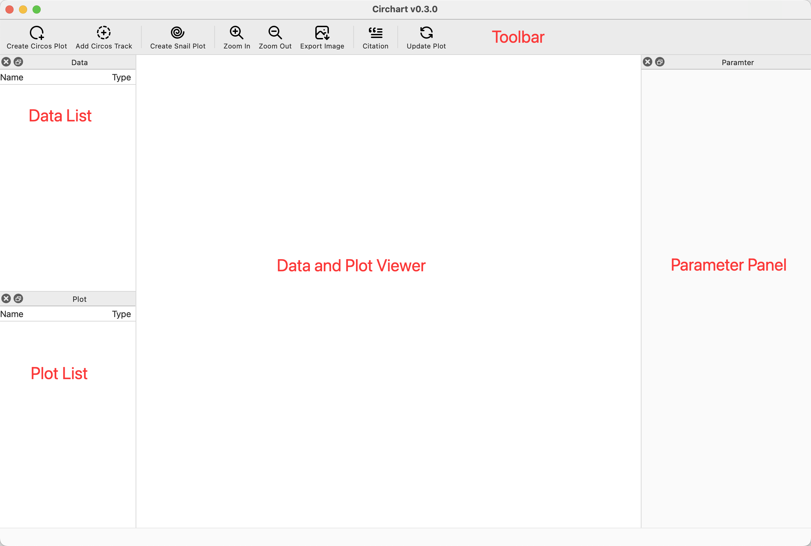

Overview
========

	The graphical user interface of circhart

Toolbar
-------

.. list-table:: The description of each icon
	:header-rows: 1
	:align: center

	* - Icon
	  - Function
	* - |newcircos|
	  - open circos plot creation dialog
	* - |addtrack|
	  - add circos plot track
	* - |newsnail|
	  - open snail plot creation dialog
	* - |zoomin|
	  - zoom in plot
	* - |zoomout|
	  - zoom out plot
	* - |export|
	  - save plot to image file
	* - |citation|
	  - view the tool citations
	* - |update|
	  - redraw the circos or snail plot

Data List
---------

The ``name`` and ``type`` of imported or prepared data will be displayed in **Data List**.

#. You can click data name to view the data contents.

#. You can change the data name using right click menu *Rename*.

#. You can delete the data from list using right click menu *Delete*.

#. For data imported from file, you can change the file path of data using right click menu *Change Path*.

Plot List
---------

The ``name`` and ``type`` of generated plots will be displayed in **Plot List**.

#. You can click plot name to view the plot image.

#. You can delete the plot from list using right click menu *Delete*.

Data and Plot Viewer
--------------------

The data content or plot image will be displayed in this viewer. For plot viewer, you can use mouse wheel to zoom in or zoom out plot.

Parameter Panel
---------------

You can adjust the plotting parameters in parameter panel.

.. |newcircos| image:: _static/new.svg
	:width: 24

.. |addtrack| image:: _static/track.svg
	:width: 24

.. |newsnail| image:: _static/spiral.svg
	:width: 24

.. |zoomin| image:: _static/zoomin.svg
	:width: 24

.. |zoomout| image:: _static/zoomout.svg
	:width: 24

.. |citation| image:: _static/citation.svg
	:width: 24

.. |update| image:: _static/refresh.svg
	:width: 24

