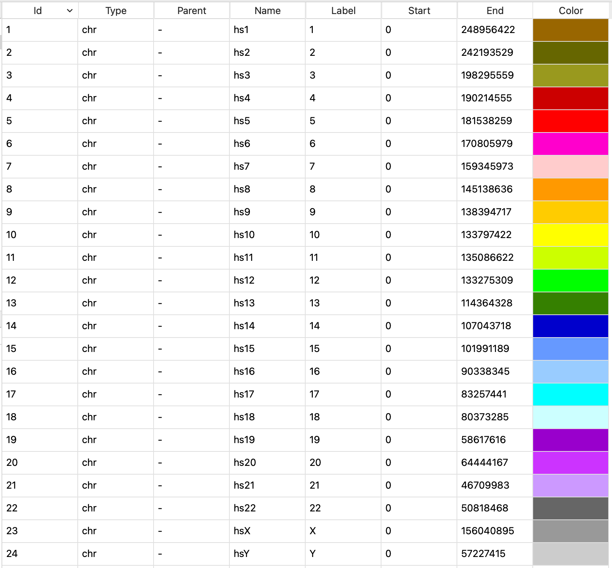

Prepare data
============

Prior to drawing circos plot, you should prepare or import data for plotting. Circhart has five data types including karyotype (band) data, plot data, link data, loci data, text data. Each data type has different columns. The columns are generally separated by a white space.

Karyotype data
--------------

The karyotype data defines the chromosomes and cytogenetic bands. It has seven columns: type, parent, name, label, start, end, color.  The name column is an unique id for each chromosome or band. The name is very important, as the other data types must use this name to distinguish different chromosomes.

.. list-table:: The description of each column
	:header-rows: 1
	:align: center

	* - Column
	  - Description
	* - type
	  - chr (for karyotype) or band (for band data)
	* - parent
	  - \- (for karyotype) or chromosome name (for band data)
	* - name
	  - chromosome uniq id
	* - label
	  - chromosome or band label
	* - start
	  - start position
	* - end
	  - end position
	* - color
	  - color name

The karyotype data example:

.. code::

	chr - hs1 NC_060925.1 0 248387328 chr1
	chr - hs2 NC_060926.1 0 242696752 chr2
	chr - hs3 NC_060927.1 0 201105948 chr3
	...

.. note::

	Karyotype data is essential for creating circos plots. You must prepare or import karyotype data before drawing circos plots.

Import karyotype data
^^^^^^^^^^^^^^^^^^^^^

If you already have karyotype data, you can import data directly into Circhart. Go to **File** menu -> **Import Data** -> **Import Karyotype Data**, select a file to import karyotype data.

.. note::

	The imported or prepared karyotype data will be assigned data type of ``karyotype``.

Prepare karyotype data
^^^^^^^^^^^^^^^^^^^^^^

If you don't have karyotype data, you can prepare karyotype data.

#. Go to **Tools** menu -> **Prepare Data** -> **Prepare Karyotype Data** to open karyotype data preparation dialog:

	.. figure:: _static/prepare_kdata.png
		:width: 500
		:align: center

		Karyotype data preparation dialog

#. Input a name for generated karyotype data.

#. Select a genome and select some chromosomes.

	.. note::

		Generally, genome file may have many unplaced sequences that we don't want to be used for plotting. You can  select only the complete chromosomes or chromosomes you desired.

#. Input an uniq chromosome name prefix. e.g. ``hs`` for human, ``mm`` for mouse, or you can also simply use ``chr`` for single genome. The circhart will use the this prefix to generate new name for each chromosome. e.g. hs1, hs2, hs3.

#. Click ``OK`` button to generate karyotype data based on selected chromosomes.

View karyotype data
^^^^^^^^^^^^^^^^^^^

You can click a karyotype data in **Data List** to view the karyotype data.

	View of karyotype data

Edit karyotype data
^^^^^^^^^^^^^^^^^^^

Circhart allows you to edit the data in columns name and color. Double-click the cell to change name and color.

The karyotype color also can be changed using following methods:

* Go to **Edit** menu -> **Karyotype Color** -> **Set to Default** to change colors to default colors.

* Go to **Edit** menu -> **Karyotype Color** -> **Set to Random** to change colors to random colors.

* Go to **Edit** menu -> **Karyotype Color** -> **Set to Single** to change all colors to a single color.

Band data
---------

The band data has the same data format with karyotype data. The band data was generally put into karyotype file. Circhart also allows you to import or prepare band data separately.

The band data example:

.. code::

	band hs1 p36.33 p36.33 0 1735965 gneg
	band hs1 p36.32 p36.32 1735965 4816989 gpos25
	band hs1 p36.31 p36.31 4816989 6629068 gneg
	band hs1 p36.23 p36.23 6629068 8634052 gpos25
	band hs1 p36.22 p36.22 8634052 12044143 gneg
	...

Import band data
^^^^^^^^^^^^^^^^

If you already have band data, you can import data directly into Circhart. Go to **File** menu -> **Import Data** -> **Import Band Data**, select a file to import band data. 

.. note::

	The imported or prepared band data will be assigned data type of ``banddata``.

Prepare band data
^^^^^^^^^^^^^^^^^

If you don't have band data, you can prepare band data. Before preparing band data, you should get genome cytobands.

#. Go to **Tools** menu -> **Prepare Data** -> **Prepare Band Data** to open band data preparation dialog:

	.. figure:: _static/prepare_band.png
		:width: 400
		:align: center

		Band data preparation dialog

#. Input a name for generated band data.

#. Select a karyotype data.

#. Select imported genome bands.

#. Click ``OK`` button to generate band data.

Plot data
---------

The plot data has four required columns (chrom, start, end, value) and on optional column (options). The plot data is used to plot line, scatter, histogram and heatmap tracks.

.. list-table:: The description of columns in plot data
	:header-rows: 1
	:align: center

	* - Column
	  - Description
	* - chrom
	  - chromosome name
	* - start
	  - start position
	* - end
	  - end position
	* - value
	  - integer or decimal
	* - options
	  - plot options, usually empty

Plot data example:

.. code::

	hs1 1000 2000 0.546
	hs1 2000 3000 0.423
	hs2 4000 6000 0.379
	...

Import plot data
^^^^^^^^^^^^^^^^

If you already have plot data, you can import data directly into Circhart. Go to **File** menu -> **Import Data** -> **Import Plot Data**, select a file to import plot data.

.. note::

	The imported or prepared plot data will be assigned data type of ``plotdata``.

Prepare plot data
^^^^^^^^^^^^^^^^^

If you don't have plot data, you can prepare plot data. Circhart can prepare different plot data using different data resource. Circhart supports calculating distribution data using both tumbling window (fixed window without overlap) and sliding window (fixed window with overlap).

Prepare GC content plot data
""""""""""""""""""""""""""""

GC content preparator can help you to calculate GC content within windows.

#. If no genome data, Go to **File** menu -> **Import Data** -> **Import Genome File** to import a genome.

#. Go to **Tools** -> **Prepare Data** -> **Prepare GC Content Data** to open GC content preparation dialog.

	.. figure:: _static/prepare_gc.png
		:width: 400
		:align: center

		GC content preparation dialog with tumbling window

#. Input a name for generated GC content data.

#. Select an imported genome.

#. Select a karyotype data.

#. Select tumbling window or sliding window.

	.. figure:: _static/prepare_gc2.png
		:width: 400
		:align: center

		GC content preparation dialog with sliding window

	.. note::

		If you select using sliding window, you should also set the step size. Step size should < window size.

#. Click ``OK`` button to generate GC content data.

Prepare GC skew plot data
"""""""""""""""""""""""""

GC skew preparator can help you to calculate GC skew within windows.

#. If no genome data, Go to **File** menu -> **Import Data** -> **Import Genome File** to import a genome.

#. Go to **Tools** -> **Prepare Data** -> **Prepare GC Skew Data** to open GC skew preparation dialog.

	.. figure:: _static/prepare_gcskew.png
		:width: 400
		:align: center

		GC skew preparation dialog

#. Input a name for generated GC skew data.

#. Select an imported genome.

#. Select a karyotype data.

#. Select tumbling window or sliding window.

#. Click ``OK`` button to generate GC skew data.

Prepare Density plot data
"""""""""""""""""""""""""

Density preparator can help you to calculate the number of features from genome annotation file (gtf/gff), the number of variations from vcf file, or the number of regions from bed file winthin windows.

#. Go to **Tools** menu -> **Prepare Data** -> **Prepare Density Data** to open density preparation dialog.

	.. figure:: _static/prepare_density.png
		:width: 400
		:align: center

		Density data preparation dialog

#. Input a name for generated plot data.

#. Select a karyotype

#. Select source data type according to your imported data.

#. Select source data.

#. If *Genome annotation (gtf or gff)* seleted, you should also select a feature.

#. Click ``OK`` button to generate GC skew data.

Text data
---------

The text data has the same columns with the plot data. The only difference is that the value column contains text instead of numbers. The text data is used to plot text track.

Text data example:

.. code::

	hs1 144134 146717 SEPTIN14P14
	hs1 148562 152332 CICP3
	hs1 372945 388041 NOC2L
	...

Import text data
^^^^^^^^^^^^^^^^

If you already have text data, you can import data directly into Circhart. Go to **File** menu -> **Import Data** -> **Import Text Data**, select a file to import text data.

.. note::

	The imported or prepared text data will be assigned data type of ``textdata``.

Prepare text data
^^^^^^^^^^^^^^^^^

Circhart allows you to extract features as text data from genome annotation file (gtf or gff).

#. If no annotation data, Go to **File** menu -> **Import Genome Annotation** to select a gtf/gff annotation file to import.

#. Go to **Tools** menu -> **Prepare Data** -> **Prepare Text Data** to open text data preparation dialog.

	.. figure:: _static/prepare_text.png
		:width: 400
		:align: center

		Text data preparation dialog

#. Input a name for generated text data.

#. Select a karyotype data.

#. Select a feature.

#. Setect an attribute you desired as text value.

#. Optionally, you can check "Only extract records whose attribute value in below list" to input attribute values (one value per line) to extract matched features.

	.. figure:: _static/prepare_text2.png
		:width: 400
		:align: center

#. Click ``OK`` button to generate text data.

Loci data
---------

The loci data has three required columns: chrom, start, end and one optional column: options. Each row defines an interval in a chromosome. The loci data used to plot tile, connector and highlight tracks.

Loci data example:

.. code::

	hs1 144134 146717
	hs1 148562 152332
	hs1 372945 388041
	...

Import loci data
^^^^^^^^^^^^^^^^

If you already have loci data, you can import data directly into Circhart. Go to **File** menu -> **Import Data** -> **Import Loci Data**, select a file to import loci data.

.. note::

	The imported or prepared loci data will be assigned data type of ``locidata``.

Link data
---------

The link data has six required columns: chrom1, start1, end1, chrom2, start2, end2 and one optional column: options. Each row has two intervals on the same or different chromosomes. The link data used to plot link track.

Link data example:

.. code::

	hs1 1000 3000 hs10 2500 3800
	hs3 7000 9500 hs8 4000 7000
	hs7 500 1500 hs12 5000 6000
	...

Import link data
^^^^^^^^^^^^^^^^

If you already have link data, you can import data directly into Circhart. Go to **File** menu -> **Import Data** -> **Import Link Data**, select a file to import link data.

.. note::

	The imported or prepared link data will be assigned data type of ``linkdata``.

Except for above format, circhart also supports importing two-line format file. Links are defined across two lines like:

.. code::

	segdup00001 hs1 465 30596
	segdup00001 hs2 114046768 114076456
	segdup00002 hs1 486 76975
	segdup00002 hs15 100263879 100338121
	segdup00003 hs1 486 30596
	segdup00003 hs9 844 30515
	segdup00004 hs1 486 9707
	segdup00004 hsY 57762276 57771573
	segdup00005 hs1 486 9707
	segdup00005 hsX 154903076 154912373
	...

Prepare link data
^^^^^^^^^^^^^^^^^

Circhart allows you to prepare link data using the collinearity file generated by MCScanX.

#. Go to **Tools** menu -> **Prepare Data** -> **Prepare Link Data** to open link data preparation dialog.

	.. figure:: _static/prepare_link.png
		:width: 400
		:align: center

		Link data preparation dialog

#. Input a name for geneated link data.

#. Select imported collinearity data.

#. Input the number of species in collinearity data.

#. Select karyotype and annotation for each species, and select corresponding feature and attribute. Make sure the value of your selected attribute can match the IDs in collinearity file.

#. Click ``OK`` button to generate link data.
